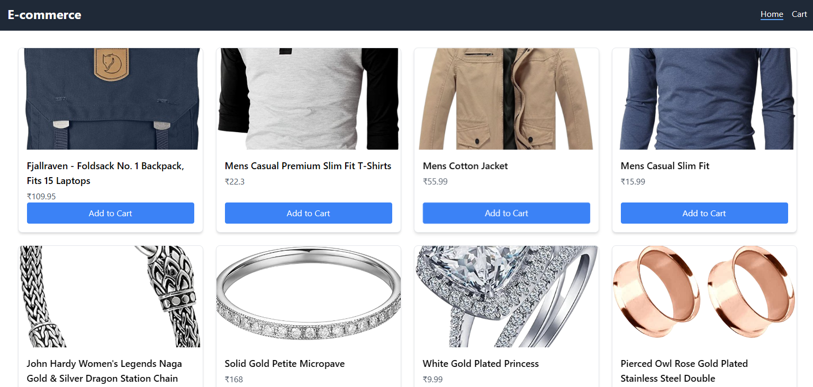
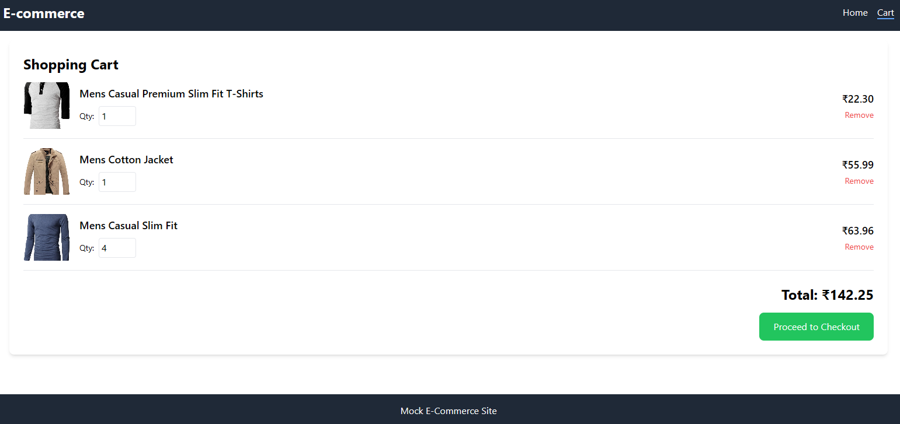

# Mock E-Commerce Cart

This project is a full-stack web application that simulates a basic e-commerce shopping cart, built to fulfill the requirements of a coding assignment.

***

## Original Assignment

> **Full Stack Coding Assignment: Mock E-Com Cart**
>
> **Overview**: Build a basic full-stack shopping cart app for Vibe Commerce screening. Handle add/remove items, totals, & mock checkout (no real payments). Tests UI, API, DB integration for e-com flows.
>
> **Tech Stack**: React (frontend), Node/Express (backend), MongoDB/SQLite (DB). Use REST APIs. GitHub deploy (no hosting).
>
> **Requirements**:
>
> **Backend APIs**:
>
> - `GET /api/products`: 5-10 mock items (id, name, price).
> - `POST /api/cart`: Add {productId, qty}.
> - `DELETE /api/cart/:id`: Remove item.
> - `GET /api/cart`: Get cart + total.
> - `POST /api/checkout`: {cartItems} → mock receipt (total, timestamp).
>
> **Frontend (React)**:
>
> - Products grid w/ "Add to Cart".
> - Cart view: Items/qty/total; remove/update buttons.
> - Checkout form (name/email); submit → receipt modal.
> - Responsive design.
>
> **Bonus**: DB persistence (mock user), error handling, Fake Store API integration.
>
> **Deliverables**: GitHub repo (/backend, /frontend, README w/ setup/screenshots/explain). 1-2 min demo video (Loom/YouTube unlisted).
>
> **Timeline**: 48 hrs. Reply w/ links. Questions? Chat here!
>
> **Submission deadline**: 08 November, 2025

***

## Project Implementation & Additions

This implementation fulfills all the core requirements of the assignment.

### Technology Choices
*   **Frontend**: React with TypeScript, Vite for tooling, and TailwindCSS for styling.
*   **Backend**: Node.js with Express.js.
*   **Database**: MongoDB with Mongoose for data modeling.

### Features Added (Beyond Core Requirements)
*   **TypeScript on Frontend**: For improved type safety and developer experience.
*   **Toast Notifications**: User-friendly feedback for actions like adding items to the cart.
*   **Persistent User Cart**: The cart is associated with a mock user stored in the database, fulfilling a bonus requirement.
*   **Database Seeding**: A script (`seed.js`) is included to easily populate the database with mock products.
*   **Environment-based Configuration**: The backend uses a `.env` file for manageable configuration.

## Folder Structure

-   `/frontend`: Contains the React client application.
-   `/backend`: Contains the Node.js/Express server and database logic.

## Setup and Installation

### Prerequisites
-   Node.js and npm
-   MongoDB (running locally or a cloud instance)

### Backend Setup
1.  **Navigate to the backend directory:**
    ```bash
    cd backend
    ```
2.  **Install dependencies:**
    ```bash
    npm install
    ```
3.  **Create a `.env` file** in the `backend` directory and add your MongoDB connection string and a port number.
    ```
    MONGODB_URI=your_mongodb_connection_string
    PORT=5000
    ```
4.  **Seed the database** with mock products (optional, but recommended):
    ```bash
    npm run seed
    ```
5.  **Start the server:**
    ```bash
    npm start
    ```
    The backend will be running on `http://localhost:5000`.

### Frontend Setup
1.  **Navigate to the frontend directory:**
    ```bash
    cd frontend
    ```
2.  **Install dependencies:**
    ```bash
    npm install
    ```
3.  **Start the development server:**
    ```bash
    npm run dev
    ```
    The frontend will be running on `http://localhost:5173` and will be set up to proxy API requests to the backend.

## Screenshots

*(Placeholder for screenshots)*

**Product Listing Page**


**Shopping Cart View**


**Checkout Modal**


## API Endpoints

| Method | Endpoint             | Description                                     |
|--------|----------------------|-------------------------------------------------|
| GET    | `/api/products`      | Fetches all available products.                 |
| GET    | `/api/cart`          | Fetches the current user's cart items and total.|
| POST   | `/api/cart`          | Adds a product to the cart.                     |
| DELETE | `/api/cart/:id`      | Removes an item from the cart.                  |
| POST   | `/api/checkout`      | Processes the checkout and returns a receipt.   |

## Demo Video

*(Placeholder for demo video link)*

-   [Link to Unlisted YouTube/Loom Video]()
